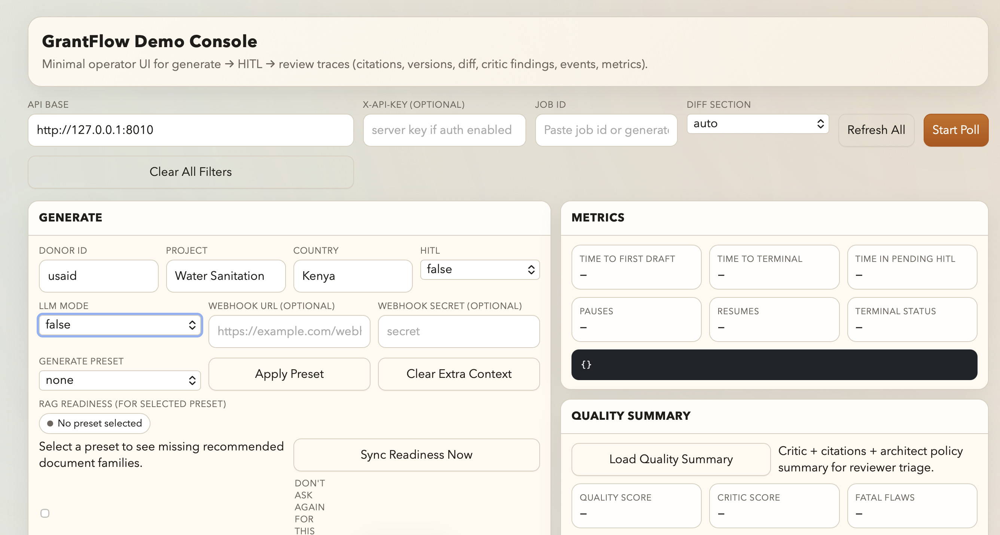

# GrantFlow

Compliance-aware, agentic proposal drafting engine for institutional funding workflows (FastAPI + LangGraph + donor strategies + HITL).

[](https://github.com/vassiliylakhonin/grantflow/actions/workflows/ci.yml)
[](https://opensource.org/licenses/MIT)
[](https://www.python.org/)
[](https://fastapi.tiangolo.com/)
[](https://www.langchain.com/langgraph)

GrantFlow helps NGOs, consultants, and program teams convert structured project ideas into donor-aligned drafts (ToC, LogFrame, MEL), with critique loops, citations, exportable artifacts, and human-in-the-loop checkpoints.

## Table of Contents

- [What GrantFlow Solves](#what-grantflow-solves)
- [Key Features](#key-features)
- [Architecture Overview](#architecture-overview)
- [Donor Coverage](#donor-coverage)
- [Quick Start](#quick-start)
- [API Overview](#api-overview)
- [Demo Console (Optional)](#demo-console-optional)
- [Human-in-the-Loop Checkpoints (MVP)](#human-in-the-loop-checkpoints-mvp)
- [RAG / Knowledge Ingestion](#rag--knowledge-ingestion)
- [Exporters](#exporters)
- [Project Structure](#project-structure)
- [Development](#development)
- [Testing](#testing)
- [Security Notes](#security-notes)
- [Roadmap](#roadmap)
- [License](#license)

## What GrantFlow Solves

GrantFlow reduces the time and effort required to turn a raw project concept into donor-aligned proposal artifacts.

It is designed for implementing organizations (e.g. DAI, Chemonics, Tetra Tech), NGOs, and program teams that need structured, reviewable drafts for institutional funding workflows.

### Outputs
- Theory of Change (ToC)
- Logical Framework / LogFrame
- MEL plan artifacts
- Exportable `.docx` / `.xlsx` (or both as ZIP)

### Estimated ROI (Early)

GrantFlow is designed to reduce drafting and review-loop overhead, not replace human review or compliance sign-off.

A practical early estimate is **~25-40% time savings** on draft/rework cycles, especially when teams repeatedly reshape the same project idea into donor-aligned formats (ToC / LogFrame / MEL).

#### Typical savings by proposal complexity (illustrative)

- **Smaller NGO / single-team proposal**: ~`8-20` drafting+rework hours baseline -> **~2-8 hours saved**
- **Multi-reviewer proposal (program + MEL + management)**: ~`20-40` hours baseline -> **~5-16 hours saved**
- **Consortium / partner-heavy / federal-style application**: ~`40+` hours baseline -> **materially higher savings**, especially in coordination and revision cycles

#### Where the savings usually come from

- faster conversion of project ideas into donor-aligned structures
- less manual reformatting/rephrasing across review rounds
- quicker internal review handoffs with HITL checkpoints
- exportable draft artifacts ready for substantive review earlier

> These are directional estimates for planning/ROI discussions. Actual savings depend on donor requirements, team maturity, and how much of the workflow is standardized.

## Key Features

- Donor strategy isolation (U.S. State Department, USAID, EU, World Bank, GIZ, plus generic donor coverage)
- Agentic workflow orchestration with LangGraph
- Critic loop for iterative quality improvement
- Human-in-the-loop checkpoints (pause/approve/resume)
- RAG-ready donor knowledge namespaces (ChromaDB)
- FastAPI backend for integration into web apps or internal tools

## Architecture Overview

GrantFlow uses a stateful graph pipeline to orchestrate specialized drafting steps:

`discovery -> architect -> mel -> critic -> (loop if needed)`

### Design principles
- Compliance-aware donor logic via Strategy Pattern
- Deterministic orchestration via LangGraph
- Explicit state transitions and job status tracking
- Review checkpoints for human governance

## Donor Coverage

GrantFlow currently supports a broad donor catalog via canonical `donor_id` values and aliases (see `GET /donors`), with two levels of support:

### Specialized strategies (donor-specific prompts / rules / schemas)
- `usaid`
- `eu`
- `worldbank`
- `giz`
- `us_state_department` (alias: `state_department`)

### Generic strategy coverage (catalog + aliases, shared drafting behavior)
Examples:
- `un_agencies` (aliases include `undp`, `unicef`, `unhcr`, `wfp`, `unwomen`, `unfpa`)
- `fcdo`
- `gavi`
- `global_fund`
- `gates_foundation`
- and additional bilateral / multilateral / foundation donors from the catalog

### Notes for integrators
- Use `GET /donors` to fetch the full supported list and aliases at runtime.
- Prefer canonical `donor_id` values in client integrations.
- Specialized donors provide stronger donor-specific behavior than generic donors.

### What "specialized" means in practice

For specialized donors, GrantFlow uses more than aliases/catalog lookup. In practice this can include:

- donor-specific strategy classes (prompt/policy behavior)
- donor-specific ToC schema contracts / validation
- donor-specific critic checklist logic / overrides
- donor-specific RAG namespace mapping / collection defaults

Generic donors still benefit from the shared pipeline (LangGraph orchestration, critic loop, exports, HITL, citations), but use shared drafting logic instead of donor-tuned rules/schemas.

## Quick Start

### 1) Install dependencies

```bash
pip install -r grantflow/requirements.txt
```

### 2) (Optional) Configure environment

```bash
export OPENAI_API_KEY=your_key_here
# or use OpenRouter (OpenAI-compatible):
# export OPENROUTER_API_KEY=your_openrouter_key
# export GRANTFLOW_LLM_BASE_URL=https://openrouter.ai/api/v1
# export OPENROUTER_HTTP_REFERER=https://your-app.example
# export OPENROUTER_X_TITLE=GrantFlow
export CHROMA_HOST=localhost
export CHROMA_PORT=8000
export CHROMA_COLLECTION_PREFIX=grantflow
# Optional API auth (enables X-API-Key on write endpoints)
# export GRANTFLOW_API_KEY=change-me
# Optional persistence (default is in-memory)
# export GRANTFLOW_JOB_STORE=sqlite
# export GRANTFLOW_HITL_STORE=sqlite
# export GRANTFLOW_INGEST_STORE=sqlite
# export GRANTFLOW_SQLITE_PATH=./grantflow_state.db
```

### 3) Run the API

```bash
uvicorn grantflow.api.app:app --reload
```

API will start on `http://127.0.0.1:8000`.

### 4) Health and readiness checks

```bash
curl -s http://127.0.0.1:8000/health
curl -s http://127.0.0.1:8000/ready
```

### 5) Generate a draft (USAID example)

```bash
curl -s -X POST http://127.0.0.1:8000/generate \
  -H 'Content-Type: application/json' \
  -d '{
    "donor_id": "usaid",
    "input_context": {
      "project": "Water Sanitation",
      "country": "Kenya"
    },
    "llm_mode": false,
    "hitl_enabled": false
  }'
```

If `GRANTFLOW_API_KEY` is configured, add `-H 'X-API-Key: <your-key>'` to write requests (for example: `/generate`, `/cancel/{job_id}`, `/resume/{job_id}`, `/hitl/approve`, `/status/{job_id}/comments`, critic finding `ack/resolve`, `/ingest`, `/export`).

### Execution Modes (Important)

`llm_mode` and `architect_rag_enabled` are independent toggles, and they change what kind of output you should expect:

| Mode | What it is good for | What the system produces |
|---|---|---|
| `llm_mode=false`, `architect_rag_enabled=false` | CI, regression tests, local smoke checks, deterministic debugging | Contract-aware deterministic drafts (schema-driven structured outputs, rule-based critic, reproducible baseline signals). Useful for pipeline validation, not for judging final prose quality. |
| `llm_mode=true`, `architect_rag_enabled=false` | Exploratory drafting without corpus setup | LLM-generated drafts and LLM critic feedback, but citations may degrade to fallback / low-confidence if no donor/context corpus is available. |
| `llm_mode=true`, `architect_rag_enabled=true` | Grounded drafting / real pilot usage | LLM-generated drafts with retrieval-backed citations (quality depends on uploaded corpus relevance and retrieval tuning). |
| `llm_mode=false`, `architect_rag_enabled=true` | Cheap retrieval/debug experiments | Deterministic drafting plus retrieval/citation instrumentation for grounding diagnostics (useful for tuning ranking/threshold policy without spending LLM tokens). |

The quick-start examples default to `llm_mode=false` because they are meant to be safe/reproducible smoke tests. For evaluating real artifact quality, use `llm_mode=true` and (ideally) corpus-backed grounded mode.

### 5b) Generate with webhooks (optional)

```bash
curl -s -X POST http://127.0.0.1:8000/generate \
  -H 'Content-Type: application/json' \
  -d '{
    "donor_id": "usaid",
    "input_context": {
      "project": "Water Sanitation",
      "country": "Kenya"
    },
    "llm_mode": false,
    "hitl_enabled": true,
    "webhook_url": "https://example.com/grantflow-webhook",
    "webhook_secret": "replace-me"
  }'
```

### 6) Check job status

```bash
curl -s http://127.0.0.1:8000/status/<JOB_ID>
```

### 7) Export artifacts (`docx`, `xlsx`, or `both`)

```bash
curl -s -X POST http://127.0.0.1:8000/export \
  -H 'Content-Type: application/json' \
  -d "{
    \"payload\": $(curl -s http://127.0.0.1:8000/status/<JOB_ID> | python3 -c 'import sys,json; print(json.dumps(json.load(sys.stdin)[\"state\"]))'),
    \"format\": \"both\"
  }" \
  -o grantflow_export.zip
```

### Additional donor examples

#### GIZ (specialized strategy)

```bash
curl -s -X POST http://127.0.0.1:8000/generate \
  -H 'Content-Type: application/json' \
  -d '{
    "donor_id": "giz",
    "input_context": {
      "project": "Youth Employment and SME Skills",
      "country": "Jordan"
    },
    "llm_mode": false,
    "hitl_enabled": false
  }'
```

#### U.S. Department of State (alias: `state_department`)

```bash
curl -s -X POST http://127.0.0.1:8000/generate \
  -H 'Content-Type: application/json' \
  -d '{
    "donor_id": "state_department",
    "input_context": {
      "project": "Independent Media Resilience",
      "country": "Georgia"
    },
    "llm_mode": false,
    "hitl_enabled": false
  }'
```

## API Overview

Core endpoints:

- `GET /health` - service health/status
- `GET /ready` - readiness check for API + vector store backend
- `GET /donors` - supported donor catalog and aliases
- `POST /generate` - start async drafting job
- `POST /cancel/{job_id}` - cancel an accepted/running/pending HITL job (best-effort)
- `GET /status/{job_id}` - poll job status/state
- `GET /status/{job_id}/citations` - retrieve typed citation/traceability records for the job
- `GET /status/{job_id}/export-payload` - retrieve a review-ready payload (`state` + `critic_findings` + `review_comments` + optional `readiness`) for `/export`
- `GET /status/{job_id}/versions` - retrieve typed draft version history snapshots (`toc` / `logframe`)
- `GET /status/{job_id}/diff` - retrieve a unified diff between draft versions (optionally filtered by section)
- `GET /status/{job_id}/critic` - retrieve typed critic findings (fatal flaws + rule checks)
- `POST /status/{job_id}/critic/findings/{finding_id}/ack` - acknowledge a critic finding
- `POST /status/{job_id}/critic/findings/{finding_id}/resolve` - resolve a critic finding
- `GET /status/{job_id}/comments` - retrieve typed reviewer comments (filterable by section/status/version)
- `POST /status/{job_id}/comments` - add a reviewer comment for `toc`, `logframe`, or `general`
- `POST /status/{job_id}/comments/{comment_id}/resolve` - mark a reviewer comment as resolved
- `POST /status/{job_id}/comments/{comment_id}/reopen` - reopen a resolved reviewer comment
- `GET /status/{job_id}/events` - retrieve typed job timeline/audit trail events
- `GET /status/{job_id}/metrics` - retrieve derived workflow/ROI metrics from the job timeline
- `GET /status/{job_id}/quality` - retrieve a typed quality summary (critic + citations + architect policy metadata + optional RAG readiness coverage)
- `GET /portfolio/metrics` - retrieve aggregated ROI/ops metrics across jobs (with filters)
- `GET /portfolio/metrics/export` - export the aggregated portfolio metrics snapshot (`csv` or `json`, optional `gzip=true`)
- `GET /portfolio/quality` - retrieve aggregated quality/critic/citation portfolio signals (with filters)
- `GET /portfolio/quality/export` - export the aggregated portfolio quality snapshot (`csv` or `json`, optional `gzip=true`)
- `POST /resume/{job_id}` - resume a HITL-paused job
- `GET /hitl/pending` - list pending checkpoints
- `POST /hitl/approve` - approve/reject checkpoint
- `POST /ingest` - upload PDF donor guidance into donor namespace (RAG ingestion)
- `GET /ingest/recent` - list recent ingest uploads (filterable by `donor_id`) for RAG prep/checklist sync
- `GET /ingest/inventory` - aggregated ingest inventory by `doc_family` (filterable by `donor_id`) for readiness/checklist coverage
- `GET /ingest/inventory/export` - export ingest inventory snapshot (`csv` or `json`, optional `gzip=true`)
- `POST /export` - export outputs as `docx`, `xlsx`, or ZIP

## Demo Console (Optional)

GrantFlow includes a built-in operator/demo UI at `GET /demo` for testing the end-to-end workflow in a browser.



_Built-in `/demo` console screenshot (Generate + Metrics + Quality Summary + portfolio-quality drill-down workflow)._

### What it supports

- Generate jobs and poll status
- Generate presets for public-sector/governance demos (USAID / EU / World Bank) with editable extra input context JSON
- Generate preset `RAG Readiness` badge (doc-family checklist coverage) for quick preflight before drafting, with a `Sync Readiness Now` shortcut, missing `doc_family` hint/tooltip, a `0/N` confirmation warning before `Generate Draft`, and a per-preset `Don't ask again` toggle
- Ingest (RAG Prep) panel with donor-specific guidance presets and direct PDF upload to `POST /ingest`
- Ingest inventory sync/export (`GET /ingest/inventory`, `GET /ingest/inventory/export`) for checklist/readiness snapshots (`Copy JSON`, `Download JSON/CSV`)
- HITL approve/reject/resume/cancel actions
- Critic findings review (fatal flaws, rule checks, citation context, confidence filter, and advisory diagnostics for LLM finding labels/gating decisions)
- Draft versions and diffs (with jump-to-diff shortcuts)
- Review comments (create, resolve/reopen, list filters)
- Export payload preview/copy and one-click review package export (`ZIP`) via `/export`
- Job events and metrics
- Portfolio metrics dashboard (filters + click-to-filter counts) plus `Portfolio Quality` risk rollups (top donors by needs-revision/open findings), LLM finding label counts (portfolio + top weighted-risk donor), a `Focused Donor (Weighted Risk)` drill-down card, and click-to-filter on top weighted-risk donors
- Portfolio Quality snapshot export from `/demo` (`Copy JSON`, `Download JSON`, `Download CSV`)

### Run and open

Start the API and open:

```bash
uvicorn grantflow.api.app:app --reload
# then open http://127.0.0.1:8000/demo
```

If API auth is enabled, paste the `X-API-Key` value into the demo toolbar once and all requests will use it.

The `Export Payload` panel can load `GET /status/{job_id}/export-payload` (including review-ready `state`, findings/comments, and optional `readiness` coverage), preview/copy the JSON, and trigger `POST /export` (`format="both"`) to download a review package ZIP directly from the UI.

### Demo Generate Presets (Examples Pack)

The `Generate` card includes preset examples that prefill `donor_id`, `project`, `country`, and `Extra Input Context JSON` for faster demos and pilot walkthroughs:

- `USAID: AI civil service (KZ)` - responsible AI civil service capacity-building / governance modernization
- `EU: digital governance (MD)` - digital service quality and administrative capacity strengthening
- `World Bank: public sector performance (UZ)` - public sector performance and service delivery capacity strengthening

These presets are editable before submitting and are intended as starting points for demo/pilot conversations rather than final proposal briefs.

The `Ingest (RAG Prep)` panel includes matching presets for these scenarios, suggests what kinds of donor/context PDFs to upload before generation, and tracks a simple metadata-driven checklist (`metadata_json.doc_family`) so you can see which recommended document types are already covered.

It can also sync checklist progress from backend ingest inventory via `GET /ingest/inventory` (aggregated by `doc_family`, useful when uploads happened outside the current browser session/demo tab) and export readiness snapshots directly from the panel (`Copy Inventory JSON`, `Download Inventory JSON/CSV`).

You can also export ingest coverage snapshots for automation/reporting:

```bash
curl -s "http://127.0.0.1:8000/ingest/inventory/export?donor_id=usaid&format=csv" -o ingest_inventory_usaid.csv
curl -s "http://127.0.0.1:8000/ingest/inventory/export?donor_id=usaid&format=json" -o ingest_inventory_usaid.json
curl -s "http://127.0.0.1:8000/ingest/inventory/export?donor_id=usaid&format=csv&gzip=true" -o ingest_inventory_usaid.csv.gz
```

### Webhook events (optional)

When `webhook_url` is provided in `POST /generate`, GrantFlow sends job lifecycle events:

- `job.started`
- `job.pending_hitl`
- `job.completed`
- `job.failed`
- `job.canceled`

Webhook payload shape:

```json
{
  "event": "job.completed",
  "job_id": "uuid",
  "status": "done",
  "job": {
    "status": "done",
    "state": { "...": "..." },
    "hitl_enabled": false,
    "webhook_configured": true
  }
}
```

If `webhook_secret` is provided, requests include `X-GrantFlow-Signature` with an HMAC SHA-256 signature of the raw request body:

```text
X-GrantFlow-Signature: sha256=<hex_digest>
```

Webhook retries/backoff (optional env vars):

- `GRANTFLOW_WEBHOOK_MAX_ATTEMPTS` (default `3`)
- `GRANTFLOW_WEBHOOK_TIMEOUT_S` (default `5.0`)
- `GRANTFLOW_WEBHOOK_BACKOFF_BASE_MS` (default `250`)
- `GRANTFLOW_WEBHOOK_BACKOFF_MAX_MS` (default `2000`)

### Citation traceability (optional)

`GET /status/{job_id}/citations` returns a typed, integration-friendly view of citation traces collected during drafting (for example, RAG hits used by the MEL step).

Citation records include confidence metadata (`citation_confidence`, `confidence_threshold`, `evidence_score`, `evidence_rank`) to support reviewer triage and integrator UX (for example, highlighting low-confidence evidence links and understanding the threshold used for architect claim support classification).

Example response shape:

```json
{
  "job_id": "uuid",
  "status": "done",
  "citation_count": 2,
  "citations": [
    {
      "stage": "mel",
      "citation_type": "rag_result",
      "namespace": "usaid_ads201",
      "source": "/path/to/usaid_guidance.pdf",
      "page": 12,
      "chunk": 3,
      "chunk_id": "usaid_ads201_p12_c0",
      "used_for": "EG.3.2-1",
      "label": "USAID ADS 201 p.12",
      "citation_confidence": 0.82,
      "confidence_threshold": 0.42,
      "evidence_score": 0.82,
      "evidence_rank": 1,
      "excerpt": "..."
    }
  ]
}
```

The same confidence values are also surfaced in:

- `/demo` (`Citation Context` filter: low/high confidence, plus client-side `architect_threshold_hit_rate` summary in `Citations`)
- exported artifacts (`.docx` citation traceability section and `.xlsx` `Citations` sheet)

### Draft version history and diffs (optional)

GrantFlow records draft snapshots during the pipeline (for example, ToC drafts from `architect` and logframe drafts from `mel`), which makes review loops easier to audit.

List versions:

```bash
curl -s http://127.0.0.1:8000/status/<JOB_ID>/versions
curl -s "http://127.0.0.1:8000/status/<JOB_ID>/versions?section=toc"
```

Get a diff (latest two versions in a section by default):

```bash
curl -s "http://127.0.0.1:8000/status/<JOB_ID>/diff?section=toc"
curl -s "http://127.0.0.1:8000/status/<JOB_ID>/diff?from_version_id=toc_v1&to_version_id=toc_v2"
```

Example diff response shape:

```json
{
  "job_id": "uuid",
  "status": "done",
  "section": "toc",
  "from_version_id": "toc_v1",
  "to_version_id": "toc_v2",
  "has_diff": true,
  "diff_text": "--- toc_v1\n+++ toc_v2\n@@ ...",
  "diff_lines": ["--- toc_v1", "+++ toc_v2", "@@ ..."]
}
```

### Critic Findings Workflow (optional)

GrantFlow exposes typed critic findings (`fatal_flaws`) with stable `finding_id` values and reviewer lifecycle status (`open`, `acknowledged`, `resolved`).

Typical reviewer workflow:

1. Read findings from `GET /status/{job_id}/critic`
2. Acknowledge a finding being triaged
3. Create a reviewer comment linked via `linked_finding_id`
4. Resolve the finding after the issue is addressed (or accepted)

Get critic findings:

```bash
curl -s http://127.0.0.1:8000/status/<JOB_ID>/critic
```

Acknowledge / resolve a finding:

```bash
curl -s -X POST http://127.0.0.1:8000/status/<JOB_ID>/critic/findings/<FINDING_ID>/ack
curl -s -X POST http://127.0.0.1:8000/status/<JOB_ID>/critic/findings/<FINDING_ID>/resolve
```

Example critic finding response shape (single item from `fatal_flaws[]`):

```json
{
  "finding_id": "uuid",
  "code": "TOC_SCHEMA_INVALID",
  "severity": "high",
  "section": "toc",
  "status": "acknowledged",
  "version_id": "toc_v2",
  "message": "ToC does not match donor-specific schema contract.",
  "fix_hint": "Revise architect output to satisfy schema validation errors.",
  "source": "rules",
  "acknowledged_at": "2026-02-25T10:15:00+00:00",
  "linked_comment_ids": ["uuid"]
}
```

### Review comments (optional)

GrantFlow supports lightweight reviewer comments tied to a job and optionally to a specific draft version (`version_id`) for `toc` / `logframe` sections.

Comments can also be linked to a critic finding via `linked_finding_id` (for example, when triaging a fatal flaw).

If `GRANTFLOW_API_KEY` is configured, send `X-API-Key` on comment write actions (`POST /status/{job_id}/comments`, `resolve`, `reopen`).

List comments (with optional filters):

```bash
curl -s http://127.0.0.1:8000/status/<JOB_ID>/comments
curl -s "http://127.0.0.1:8000/status/<JOB_ID>/comments?section=toc&status=open"
```

Add a comment:

```bash
curl -s -X POST http://127.0.0.1:8000/status/<JOB_ID>/comments \
  -H 'Content-Type: application/json' \
  -d '{
    "section": "toc",
    "message": "Please tighten assumptions and clarify beneficiary targeting.",
    "author": "reviewer-1",
    "version_id": "toc_v2",
    "linked_finding_id": "<FINDING_ID>"
  }'
```

Manage critic finding status (optional reviewer triage workflow):

```bash
curl -s -X POST http://127.0.0.1:8000/status/<JOB_ID>/critic/findings/<FINDING_ID>/ack
curl -s -X POST http://127.0.0.1:8000/status/<JOB_ID>/critic/findings/<FINDING_ID>/resolve
```

Resolve / reopen a comment:

```bash
curl -s -X POST http://127.0.0.1:8000/status/<JOB_ID>/comments/<COMMENT_ID>/resolve
curl -s -X POST http://127.0.0.1:8000/status/<JOB_ID>/comments/<COMMENT_ID>/reopen
```

Example comment response shape:

```json
{
  "comment_id": "uuid",
  "ts": "2026-02-24T12:00:00+00:00",
  "section": "toc",
  "status": "open",
  "message": "Please tighten assumptions and clarify beneficiary targeting.",
  "author": "reviewer-1",
  "version_id": "toc_v2",
  "linked_finding_id": "uuid"
}
```

### Job timeline and metrics (optional)

GrantFlow also exposes a typed job timeline (`events`) and derived workflow metrics (`metrics`) for auditability and ROI tracking.

Get timeline events:

```bash
curl -s http://127.0.0.1:8000/status/<JOB_ID>/events
```

Get derived metrics:

```bash
curl -s http://127.0.0.1:8000/status/<JOB_ID>/metrics
```

Get aggregated portfolio metrics (optional filters):

```bash
curl -s http://127.0.0.1:8000/portfolio/metrics
curl -s "http://127.0.0.1:8000/portfolio/metrics?donor_id=usaid&status=done&hitl_enabled=true"
```

Get aggregated portfolio quality summary (optional filters):

```bash
curl -s http://127.0.0.1:8000/portfolio/quality
curl -s "http://127.0.0.1:8000/portfolio/quality?donor_id=usaid&status=done&hitl_enabled=true"
```

Export aggregated portfolio metrics snapshot (CSV / JSON / GZip):

```bash
curl -s "http://127.0.0.1:8000/portfolio/metrics/export?donor_id=usaid&status=done&format=csv" \
  -o portfolio_metrics.csv

curl -s "http://127.0.0.1:8000/portfolio/metrics/export?donor_id=usaid&format=json" \
  -o portfolio_metrics.json

curl -s "http://127.0.0.1:8000/portfolio/metrics/export?donor_id=usaid&status=done&format=csv&gzip=true" \
  -o portfolio_metrics.csv.gz
```

Export aggregated portfolio quality snapshot (CSV):

```bash
curl -s "http://127.0.0.1:8000/portfolio/quality/export?donor_id=usaid&status=done&hitl_enabled=true&format=csv" \
  -o portfolio_quality.csv
```

CSV exports flatten nested objects into `field,value` rows, including donor drill-down fields such as `donor_weighted_risk_breakdown.<donor>.llm_advisory_applied_label_counts.*` and `...llm_advisory_rejected_label_counts.*`.

Export aggregated portfolio quality snapshot (JSON or GZip):

```bash
curl -s "http://127.0.0.1:8000/portfolio/quality/export?donor_id=usaid&format=json" \
  -o portfolio_quality.json

curl -s "http://127.0.0.1:8000/portfolio/quality/export?donor_id=usaid&status=done&format=csv&gzip=true" \
  -o portfolio_quality.csv.gz
```

Example metrics response shape:

```json
{
  "job_id": "uuid",
  "status": "done",
  "event_count": 12,
  "status_change_count": 8,
  "pause_count": 1,
  "resume_count": 1,
  "time_to_first_draft_seconds": 42.7,
  "time_to_terminal_seconds": 185.3,
  "time_in_pending_hitl_seconds": 96.2,
  "terminal_status": "done"
}
```

Get aggregated quality summary (critic + citations + architect metadata):

```bash
curl -s http://127.0.0.1:8000/status/<JOB_ID>/quality
```

Example quality summary response shape:

```json
{
  "job_id": "uuid",
  "status": "done",
  "quality_score": 9.1,
  "critic_score": 8.9,
  "needs_revision": false,
  "terminal_status": "done",
  "time_to_first_draft_seconds": 42.7,
  "critic": {
    "fatal_flaw_count": 2,
    "open_finding_count": 1,
    "high_severity_fatal_flaw_count": 1,
    "failed_rule_check_count": 1,
    "warned_rule_check_count": 2
  },
  "citations": {
    "citation_count": 8,
    "architect_citation_count": 5,
    "mel_citation_count": 3,
    "citation_confidence_avg": 0.58,
    "high_confidence_citation_count": 3,
    "low_confidence_citation_count": 2,
    "rag_low_confidence_citation_count": 1,
    "architect_threshold_hit_rate": 0.6
  },
  "architect": {
    "engine": "fallback:contract_synthesizer",
    "retrieval_enabled": true,
    "retrieval_hits_count": 3,
    "toc_schema_valid": true,
    "citation_policy": {
      "threshold_mode": "donor_section"
    }
  }
}
```

The `/demo` console exposes the same aggregate via the `Quality Summary` panel for reviewer triage.

Example portfolio metrics response shape:

```json
{
  "job_count": 24,
  "filters": {
    "donor_id": "usaid",
    "status": "done",
    "hitl_enabled": true
  },
  "status_counts": {
    "done": 24
  },
  "donor_counts": {
    "usaid": 24
  },
  "terminal_job_count": 24,
  "hitl_job_count": 24,
  "total_pause_count": 24,
  "total_resume_count": 24,
  "avg_time_to_first_draft_seconds": 48.2,
  "avg_time_to_terminal_seconds": 210.4,
  "avg_time_in_pending_hitl_seconds": 102.7
}
```

Example portfolio quality response shape:

```json
{
  "job_count": 24,
  "filters": {
    "donor_id": "usaid",
    "status": "done",
    "hitl_enabled": true
  },
  "terminal_job_count": 24,
  "avg_quality_score": 8.4,
  "avg_critic_score": 8.1,
  "severity_weighted_risk_score": 129,
  "high_priority_signal_count": 25,
  "critic": {
    "open_findings_total": 9,
    "open_findings_per_job_avg": 0.375,
    "high_severity_findings_total": 3,
    "fatal_flaws_total": 21,
    "needs_revision_job_count": 6,
    "needs_revision_rate": 0.25,
    "llm_finding_label_counts": {
      "CAUSAL_LINK_DETAIL": 4,
      "BASELINE_TARGET_MISSING": 3
    },
    "llm_advisory_diagnostics_job_count": 10,
    "llm_advisory_applied_job_count": 7,
    "llm_advisory_applied_rate": 0.7,
    "llm_advisory_candidate_finding_count": 14,
    "llm_advisory_rejected_reason_counts": {
      "grounding_threshold_not_met": 3
    }
  },
  "citations": {
    "citation_count_total": 132,
    "citation_confidence_avg": 0.61,
    "low_confidence_citation_count": 18,
    "low_confidence_citation_rate": 0.1364,
    "rag_low_confidence_citation_count": 7,
    "rag_low_confidence_citation_rate": 0.053,
    "architect_threshold_hit_rate_avg": 0.72
  },
  "priority_signal_breakdown": {
    "high_severity_findings_total": { "count": 3, "weight": 5, "weighted_score": 15 },
    "open_findings_total": { "count": 9, "weight": 4, "weighted_score": 36 },
    "needs_revision_job_count": { "count": 6, "weight": 4, "weighted_score": 24 },
    "rag_low_confidence_citation_count": { "count": 7, "weight": 3, "weighted_score": 21 },
    "low_confidence_citation_count": { "count": 18, "weight": 1, "weighted_score": 18 }
  },
  "donor_weighted_risk_breakdown": {
    "usaid": {
      "weighted_score": 96,
      "high_priority_signal_count": 19,
      "open_findings_total": 9,
      "high_severity_findings_total": 3,
      "needs_revision_job_count": 6,
      "low_confidence_citation_count": 12,
      "rag_low_confidence_citation_count": 4,
      "llm_finding_label_counts": {
        "CAUSAL_LINK_DETAIL": 3,
        "BASELINE_TARGET_MISSING": 2
      },
      "llm_advisory_diagnostics_job_count": 4,
      "llm_advisory_applied_job_count": 3,
      "llm_advisory_applied_rate": 0.75,
      "llm_advisory_candidate_finding_count": 5,
      "llm_advisory_rejected_reason_counts": {
        "grounding_threshold_not_met": 1
      },
      "llm_advisory_applied_label_counts": {
        "CAUSAL_LINK_DETAIL": 2,
        "ASSUMPTION_EVIDENCE": 1
      },
      "llm_advisory_rejected_label_counts": {
        "BASELINE_TARGET_MISSING": 1
      }
    }
  },
  "donor_needs_revision_counts": {
    "usaid": 6
  },
  "donor_open_findings_counts": {
    "usaid": 9
  }
}
```

The `/demo` console `Portfolio Quality` panel visualizes these weighted risk signals with KPI cards, top-donor weighted-risk lists (click-to-filter), LLM finding label drill-downs (portfolio-level and top weighted-risk donor), a `Focused Donor (Weighted Risk)` drill-down card (summary + labels + advisory rejected reasons + advisory label mix applied vs rejected), top-donor advisory applied/rejected drill-downs, and advisory-normalization portfolio diagnostics (applied jobs + top rejected reasons).

## Human-in-the-Loop Checkpoints (MVP)

GrantFlow supports pause/approve/resume checkpoints in the drafting flow.

- ToC checkpoint after architect step
- LogFrame checkpoint after MEL step
- Resume behavior depends on approval vs rejection
- Job status transitions include `pending_hitl`

## RAG / Knowledge Ingestion

GrantFlow is RAG-ready and uses ChromaDB namespaces for donor knowledge.

- Namespace isolation via collection prefix (`CHROMA_COLLECTION_PREFIX`)
- Persistent Chroma client by default (`./chroma_db`)
- In-memory fallback behavior for local/offline smoke tests
- Donor strategies can map to donor-specific knowledge collections

### Grounding quality is corpus-dependent (important)

RAG integration is real, but grounded output quality depends heavily on:

- what donor/context PDFs you upload
- how well those documents match the proposal topic
- retrieval/ranking/threshold tuning

Without a useful corpus, the system still works, but citation quality can degrade to fallback namespace references or low-confidence citations. This is why GrantFlow includes explicit citation confidence, threshold-hit, and grounding-risk diagnostics.

Illustrative examples from local seeded-corpus experiments (not a universal benchmark):

- **Ungrounded LLM eval lane (no corpus)**: `fallback_dominant:high(100%)` across donors was common
- **Grounded World Bank (single-case LLM run, seeded corpus)**: `fallback_namespace_citation_count=0`, `rag_low_confidence_citation_count=0`, `architect_threshold_hit_rate=1.0`
- **Grounded USAID (single-case LLM run, seeded corpus)**: `fallback_namespace_citation_count=0`, with measurable improvement after tuning (`architect_threshold_hit_rate` and `citation_confidence_avg` increased; `rag_low_confidence` decreased)

Use `/status/{job_id}/quality`, `/status/{job_id}/citations`, and `/portfolio/quality` to inspect whether a run is truly grounded vs merely schema-valid.

### Grounded vs. Ungrounded (illustrative snapshot)

These examples are intentionally small and not meant as a formal benchmark. They are useful for understanding *what changes* when corpus-backed grounding is available.

| Scenario | Donor | Scope | `quality_score` | Grounding signal | Notes |
|---|---|---|---:|---|---|
| Ungrounded LLM eval lane | `usaid` | suite-level donor aggregate (4 cases) | `avg_q=7.25` | `fallback_dominance=high (100%)`, `fallback_ns_citations=107/107` | LLM drafting works, but citations are fallback-only without corpus |
| Ungrounded LLM eval lane | `worldbank` | suite-level donor aggregate (2 cases) | `avg_q=7.75` | `fallback_dominance=high (100%)`, `fallback_ns_citations=38/38` | Schema-valid outputs, weak evidence grounding |
| Grounded LLM run (seeded corpus) | `worldbank` | single-case | `8.5` | `fallback_namespace_citation_count=0`, `rag_low_confidence_citation_count=0`, `architect_threshold_hit_rate=1.0` | Grounding and critic quality improved after retrieval/policy tuning |
| Grounded LLM run (seeded corpus) | `usaid` | single-case | `8.5` | `fallback_namespace_citation_count=0`, `architect_threshold_hit_rate=0.5484`, `citation_confidence_avg=0.4226` | Grounding improved materially, but some low-confidence citations remained |

## Exporters

Current exporters generate:

- `.docx` from ToC content
- `.xlsx` from LogFrame content
- ZIP bundle when `format="both"`

Review-ready export metadata (optional):

- `Citation Traceability` is included in `.docx` and the `Citations` sheet in `.xlsx`
- `Critic Findings` and `Review Comments` are included when provided in `/export` payload (`critic_findings[]`, `review_comments[]`) or available in `payload.state.critic_notes.fatal_flaws`

Integrator shortcut:

```bash
curl -s http://127.0.0.1:8000/status/<JOB_ID>/export-payload | jq .
```

The returned `payload` can be sent directly into `POST /export` (with optional edits) to produce a review package that includes citations, critic findings, and reviewer comments.

### Artifact samples (current state)

The README now includes a sanitized output snippet and links to **sanitized sample export artifacts** generated with current exporters:

- [`docs/samples/grantflow-sample-toc-review-package.docx`](docs/samples/grantflow-sample-toc-review-package.docx)
- [`docs/samples/grantflow-sample-logframe-review-package.xlsx`](docs/samples/grantflow-sample-logframe-review-package.xlsx)
- [`docs/samples/grantflow-sample-export-payload.json`](docs/samples/grantflow-sample-export-payload.json)

There is still room to improve artifact proof in docs (for example, embedded screenshots of the generated `.docx/.xlsx` pages and a real `/demo` GIF instead of the placeholder visual). For evaluators, the strongest current evidence of artifact quality is:

- local/demo runs (`/demo`)
- typed API outputs (`/status/{job_id}/quality`, `/critic`, `/citations`, `/versions`, `/diff`)
- eval harness reports (`eval-report.txt`, `llm-eval-report.txt`)

### Sanitized Sample Output Snippet (illustrative)

Below is a shortened, sanitized example of the *kind* of structured draft content GrantFlow produces before export (`.docx` / `.xlsx`). Exact fields and wording vary by donor strategy and mode.

**ToC / Results chain excerpt (USAID-style, shortened)**

```json
{
  "project_goal": "Improve public sector efficiency and service quality through responsible AI use in government workflows.",
  "development_objective": {
    "title": "Strengthen institutional capacity of participating government agencies in Kazakhstan to safely and effectively apply AI in priority functions.",
    "intermediate_results": [
      {
        "ir_id": "IR1",
        "title": "Civil servants improve practical competencies in responsible AI use",
        "outputs": [
          "Agency needs assessment and baseline competency mapping completed",
          "Cohort-based training and ToT delivered",
          "Applied labs completed for priority workflow use-cases"
        ]
      }
    ]
  }
}
```

**LogFrame / MEL excerpt (sheet-style, shortened)**

| Level | Result statement | Indicator | Baseline | Target | Means of verification |
|---|---|---|---|---|---|
| DO | Institutional capacity for responsible AI use strengthened | % of participating agencies applying approved AI SOPs in pilot workflows | 0 | 60% by endline | Agency SOP adoption records, pilot implementation logs |
| IR1 | Civil servants improve practical AI competencies | % of trained participants scoring above competency threshold in post-test | TBD (baseline) | 75% | Pre/post assessments, training attendance records |
| Output | Cohort training delivered | # civil servants completing training modules | 0 | 600-1000 | Training completion registers |

These artifacts can be exported directly and enriched with citation traceability, critic findings, and review comments via `POST /export` and `GET /status/{job_id}/export-payload`.

## Project Structure

```text
grantflow/
  api/              FastAPI app and endpoints
  core/             config + donor strategy logic
  exporters/        Word/Excel artifact builders
  memory_bank/      Chroma wrapper / vector store
  swarm/            LangGraph pipeline + nodes + HITL
  tests/            pytest suite
```

Top-level scripts:

- `deploy.sh` - local/production Docker deployment helper
- `backup.sh` - ChromaDB backup rotation helper

## Development

Local development loop:

```bash
pip install -r grantflow/requirements.txt
uvicorn grantflow.api.app:app --reload
```

Optional dev tooling (format/lint hooks):

```bash
pip install -r requirements-dev.txt
pre-commit install
pre-commit run --all-files
```

Pre-commit hooks run `ruff` (autofix + minified-Python guard), `isort`, `black`, and targeted baseline `mypy`.

Manual formatting/lint commands (if you prefer running tools directly):

```bash
ruff check grantflow
isort grantflow
black grantflow
mypy grantflow/api grantflow/core/stores.py grantflow/swarm/versioning.py
```

Optional environment variables:

- `OPENAI_API_KEY`
- `CHROMA_HOST`
- `CHROMA_PORT`
- `CHROMA_COLLECTION_PREFIX`
- `CHROMA_PERSIST_DIRECTORY`
- `GRANTFLOW_API_KEY` (if set, protected write endpoints require `X-API-Key`)
- `GRANTFLOW_REQUIRE_AUTH_FOR_READS` (`true` to require `X-API-Key` for read endpoints such as `/status/*`, `/portfolio/*`, `/ingest/*`, and `/hitl/pending`)
- `GRANTFLOW_JOB_STORE` (`inmem` or `sqlite`)
- `GRANTFLOW_HITL_STORE` (`inmem` or `sqlite`, defaults to job store mode)
- `GRANTFLOW_INGEST_STORE` (`inmem` or `sqlite`, defaults to job store mode)
- `GRANTFLOW_SQLITE_PATH` (SQLite file path for job/HITL/ingest persistence)
- `GRANTFLOW_WEBHOOK_MAX_ATTEMPTS`
- `GRANTFLOW_WEBHOOK_TIMEOUT_S`
- `GRANTFLOW_WEBHOOK_BACKOFF_BASE_MS`
- `GRANTFLOW_WEBHOOK_BACKOFF_MAX_MS`

### Docker Compose persistence/auth notes

- `docker-compose.yml` is configured to use SQLite-backed job/HITL persistence by default.
- API state DB is stored in the `grantflow_state` volume (`/data/grantflow_state.db` in the container).
- To protect write endpoints in deployment, set `GRANTFLOW_API_KEY` in your `.env` and send `X-API-Key` from clients.
- If you use webhooks, prefer HTTPS endpoints and set `webhook_secret` to verify `X-GrantFlow-Signature`.

## Testing

Run tests:

```bash
python -m pytest -c grantflow/pytest.ini grantflow/tests/ -v --tb=short
```

Evaluation harness (baseline quality regression suite):

```bash
python -m grantflow.eval.harness
python -m pytest -c grantflow/pytest.ini grantflow/tests/test_eval_harness.py -v
```

The bundled evaluation fixtures run deterministic (`llm_mode=false`) draft generation across a small donor mix and check baseline quality signals such as:

- ToC schema validity (`toc_validation`)
- critic / quality scores
- fatal flaw counts (including high-severity flaws)
- citation coverage (architect + MEL)
- citation confidence quality (including `high_confidence_citation_count` and `architect_threshold_hit_rate`)
- draft version traceability and error count

CI also runs the evaluation harness as a dedicated `eval` job and compares current results against the committed baseline snapshot:

- `grantflow/eval/fixtures/baseline_regression_snapshot.json`

The `eval` job fails on metric regressions (for tracked quality/citation/error signals) but does not fail on new/missing cases; those are reported as warnings in the uploaded eval artifact.

The text eval artifact (`eval-report.txt`) also includes a donor-level quality breakdown (cases/pass-rate, average quality score, needs-revision rate, high-severity flaws, and low-confidence citation counts) to highlight top-risk donor buckets quickly.

An additional `LLM Eval` workflow (`.github/workflows/llm-eval.yml`) is available as a separate nightly/manual lane (`workflow_dispatch` + `schedule`) that runs the same fixtures with `--force-llm` in exploratory metrics mode (`--skip-expectations`) and uploads `llm-eval-report` artifacts. It is intentionally separate from the main CI baseline to avoid destabilizing deterministic regression checks. If `OPENAI_API_KEY` is not configured in repository secrets, the workflow uploads a skipped report artifact instead of failing.

For corpus-backed experiments, use the manual `LLM Eval (Grounded)` workflow (`.github/workflows/llm-eval-grounded.yml`). It supports donor/case subset filters (for example `usaid,eu,worldbank`), can force `architect_rag_enabled=true`, reads optional `CHROMA_*` repository variables, and uploads a separate `llm-eval-grounded-report` artifact for comparison against the ungrounded exploratory lane.
The workflow also supports `OPENROUTER_API_KEY` (OpenAI-compatible backend) and will run if either `OPENAI_API_KEY` or `OPENROUTER_API_KEY` is configured in repository secrets.

### Pilot validation pack example

A sanitized multi-donor pilot snapshot is included under:

- [`docs/pilot_runs/2026-02-27/summary.md`](docs/pilot_runs/2026-02-27/summary.md)
- [`docs/pilot_runs/2026-02-27/benchmark-results.json`](docs/pilot_runs/2026-02-27/benchmark-results.json)

Source-label fix refresh (P1) is available under:

- [`docs/pilot_runs/2026-02-27-p1-source-fix/summary.md`](docs/pilot_runs/2026-02-27-p1-source-fix/summary.md)
- [`docs/pilot_runs/2026-02-27-p1-source-fix/benchmark-results.json`](docs/pilot_runs/2026-02-27-p1-source-fix/benchmark-results.json)

Per-donor subfolders contain:

- typed API snapshots (`status`, `quality`, `critic`, `citations`, `metrics`, `events`, `versions`)
- review-ready export payload snapshot
- exported artifacts (`.docx`, `.xlsx`, `.zip`)

Rebuild a pilot pack from an existing benchmark file:

```bash
python docs/pilot_runs/generate_pilot_pack.py \
  --api-base http://127.0.0.1:8000 \
  --benchmark-json docs/pilot_runs/2026-02-27/benchmark-results.json \
  --output-dir docs/pilot_runs/2026-02-27
```

### OpenAI-Compatible Backends (OpenRouter)

GrantFlow's LLM calls use an OpenAI-compatible client path (`langchain_openai`). In addition to `OPENAI_API_KEY`, you can use OpenRouter:

```bash
export OPENROUTER_API_KEY=your_openrouter_key
export GRANTFLOW_LLM_BASE_URL=https://openrouter.ai/api/v1
# Optional but recommended for OpenRouter:
export OPENROUTER_HTTP_REFERER=https://your-app.example
export OPENROUTER_X_TITLE=GrantFlow
```

Notes:

- `OPENAI_API_KEY` takes precedence if both keys are set.
- If `OPENROUTER_API_KEY` is set and no base URL is provided, GrantFlow defaults to `https://openrouter.ai/api/v1`.
- You can also use generic envs (`GRANTFLOW_LLM_HTTP_REFERER`, `GRANTFLOW_LLM_APP_NAME`) instead of OpenRouter-specific header envs.

If you intentionally improve scoring/quality behavior and want to refresh the baseline snapshot, regenerate it locally and commit the update with the corresponding code changes:

```bash
python -m grantflow.eval.harness \
  --baseline-snapshot-out grantflow/eval/fixtures/baseline_regression_snapshot.json
```

Shell checks:

```bash
bash -n deploy.sh
bash -n backup.sh
shellcheck deploy.sh backup.sh
```

CI runs Python tests, shell script lint/syntax checks, and a targeted `mypy` baseline (`grantflow/api`, `grantflow/core/stores.py`, `grantflow/swarm/versioning.py`).

If you enable local pre-commit hooks, they will run `ruff` (including minified-Python guard), `isort`, `black`, and targeted baseline `mypy` before commit.

## Security Notes

- Do not commit real API keys in `.env`
- Review generated proposal content before external submission
- Treat donor guidance and uploaded source materials as sensitive
- Validate exported artifacts in your internal QA/compliance workflow

## Roadmap

- Expand donor-specific strategies, schemas, and validation rules
- Improve citation grounding quality (ranking, confidence, and evidence fidelity)
- Evolve the review UI beyond the demo console (section comments, diff navigation, reviewer workflows)
- Strengthen donor-ready export templates and formatting controls
- Broaden reliability/test coverage for concurrency, persistence, and failure recovery edge cases

## License

MIT. See `LICENSE` for the full license text.
