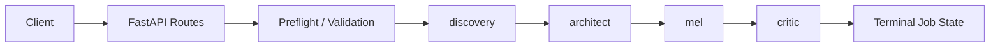
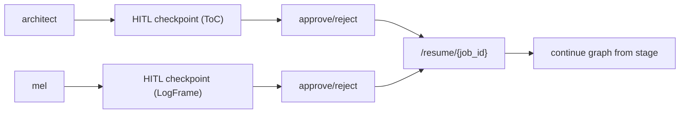
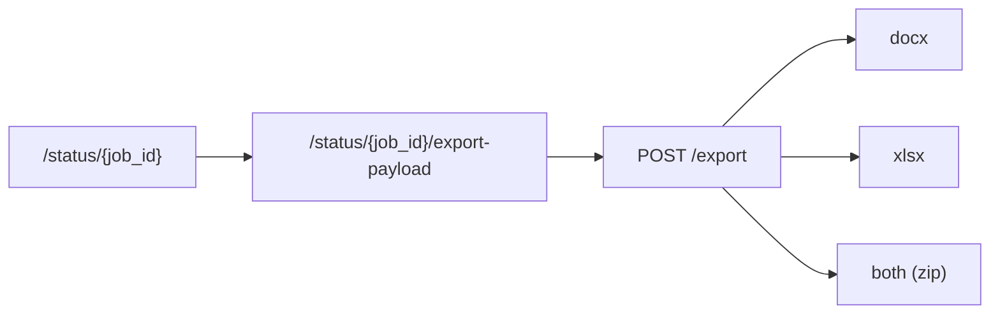

# Architecture Overview

This document describes the current backend execution shape without product redesign assumptions.

## Request and Orchestration Path

## HITL and Resume Path

## Export Path

## Runtime Topologies

- Local/dev default:
  - API in `background_tasks` mode
  - in-memory stores allowed
- Recommended production:
  - API in `redis_queue` dispatcher mode
  - dedicated worker process (`python -m grantflow.worker`)
  - persistent sqlite stores

See `README.md` for quick-start and `docs/operations-runbook.md` for operational checks.
