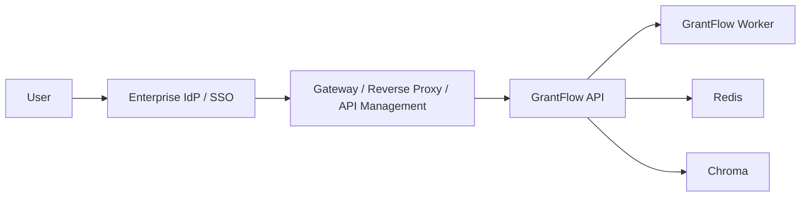

# Enterprise Access Layer

This document describes the fastest credible enterprise-access posture for GrantFlow without changing the core application model.

## Current Reality

Verified in repo:
- built-in auth model is API-key based
- startup guards can require API key in production mode
- tenant allowlist controls exist
- review, export, generate, ingest, and portfolio APIs are already separable by route family

Not built into the app:
- OIDC / SAML login
- in-app RBAC
- user identity propagation and audit by person

Conclusion:
- for pilot and early enterprise use, access control should be enforced at the gateway/platform layer

## Recommended Access Pattern

Use this chain:

The gateway should:
- enforce user authentication
- enforce route-level authorization
- inject the shared `X-API-Key` toward GrantFlow
- keep Redis and Chroma off the public network

## Pilot Role Model

These roles are not enforced in-app today. They should be enforced at the gateway/policy layer.

### Viewer

Allowed:
- `GET /health`
- `GET /ready`
- `GET /status/*`
- `GET /portfolio/*`

Blocked:
- generate
- ingest
- review mutations
- resume / HITL actions

### Operator

Allowed:
- viewer routes
- `POST /generate`
- `POST /generate/from-preset`
- `POST /export`
- review comment/finding updates needed for triage

Blocked:
- ingest administration unless explicitly delegated

### Reviewer

Allowed:
- viewer routes
- findings/comment ack/resolve/reopen routes
- review workflow exports

Blocked:
- ingest
- runtime/admin operations

### Approver

Allowed:
- reviewer routes
- `POST /hitl/approve`
- `POST /resume/{job_id}`

### Ingest Admin

Allowed:
- donor corpus ingest and inventory endpoints

## Suggested Route Policy Split

### Read-only
- `/status/*`
- `/portfolio/*`
- `/health`
- `/ready`

### Draft/Run
- `/generate*`
- `/export`
- `/cancel/*`

### Review Operations
- `/status/{job_id}/critic/*`
- `/status/{job_id}/comments*`
- `/status/{job_id}/review/workflow*`
- `/hitl/approve`
- `/resume/*`

### Corpus Administration
- `/ingest*`

## Gateway Pattern For Pilot

Recommended pilot posture:
- expose only the gateway publicly
- keep GrantFlow API on private network
- keep Redis and Chroma internal only
- use one shared `X-API-Key` between gateway and GrantFlow
- enforce user/group access at gateway

This is enough to close the main access-control gap for a bounded pilot without rewriting core auth.

## Audit And Identity Notes

Today GrantFlow does not claim person-level in-app identity or RBAC.

For pilot/enterprise evaluation:
- keep identity logs at the gateway
- keep route authorization at the gateway
- treat GrantFlow as a protected backend service

If a later phase requires in-app identity awareness, add it deliberately as a separate product track.

## Recommended Pilot Policy

Minimum acceptable pilot posture:
- API key enabled
- production mode startup guards enabled
- private network for Redis and Chroma
- gateway-enforced SSO or corporate access control
- route-based access policy for operator / reviewer / approver / ingest admin

## What This Solves Quickly

- buyer concern: "there is no enterprise auth"
- partner concern: "how do we front this with our platform?"
- pilot concern: "can we keep access limited by role without rewriting the app?"

## What It Does Not Solve

- deep in-app RBAC
- per-user audit in application state
- fine-grained object permissions inside GrantFlow

Those remain future product work, not required to run a credible pilot.
