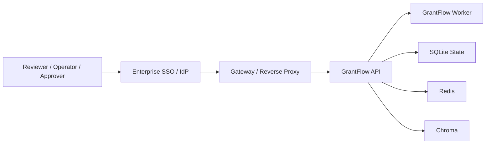

# Reference Topology

This is the recommended bounded enterprise-style deployment shape for GrantFlow.

## Public Edge

Publicly expose only:
- gateway or reverse proxy

Do not expose directly:
- GrantFlow API
- Redis
- Chroma

## Application Layer

Run:
- API as dispatcher
- worker as separate process

Recommended mode:
- `GRANTFLOW_JOB_RUNNER_MODE=redis_queue`
- `GRANTFLOW_JOB_RUNNER_CONSUMER_ENABLED=false`

## Trust Boundary

The gateway should:
- authenticate users
- authorize by route family
- inject `X-API-Key` to GrantFlow
- log user identity and access decisions

## Storage Boundary

For bounded production-like deployments:
- keep sqlite on durable disk
- keep Redis internal
- keep Chroma internal

## Reviewer Console Boundary

`GET /demo` should be treated as an internal reviewer console.
It is useful for evaluation, pilot operations, and internal reviewer workflows.
It should not be treated as a public end-user application.
